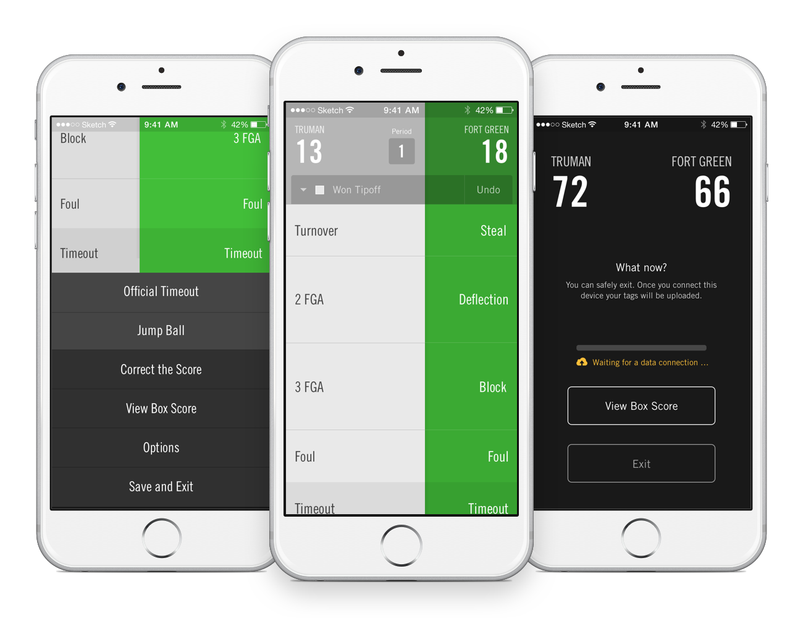
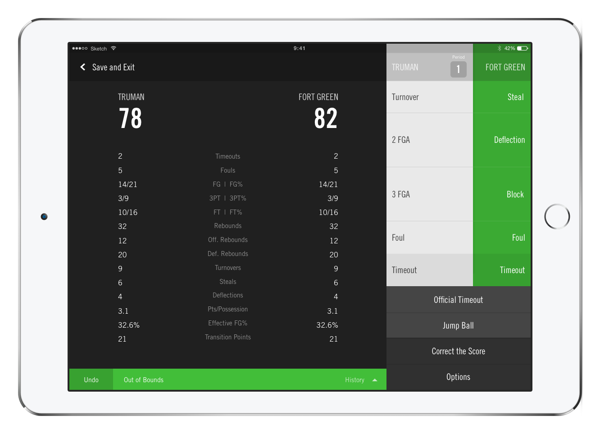
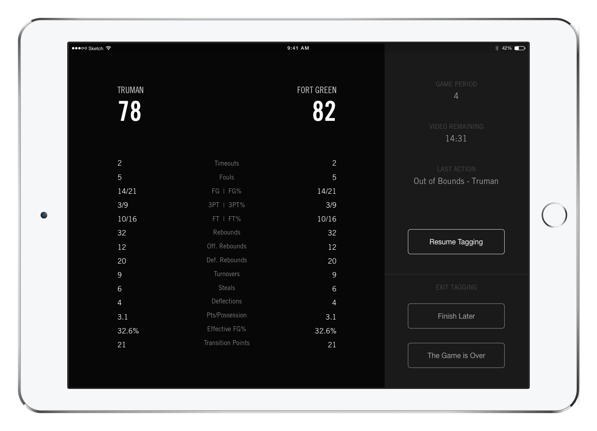
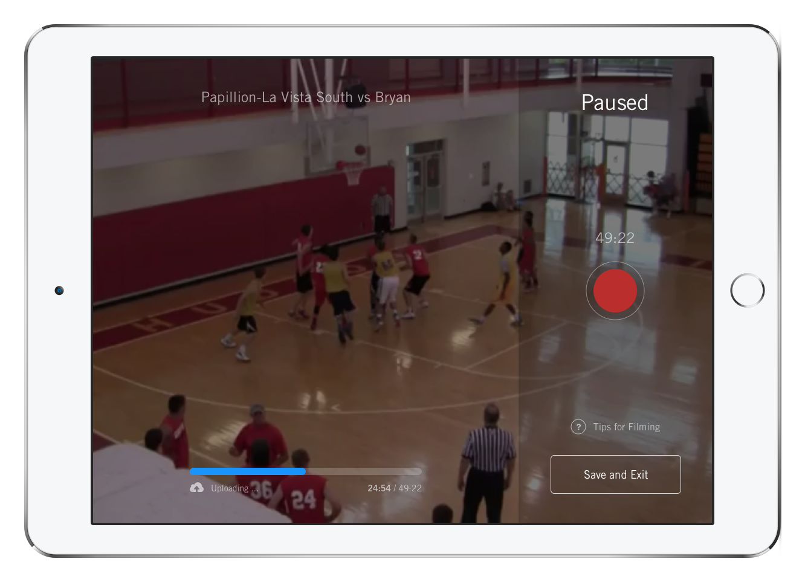
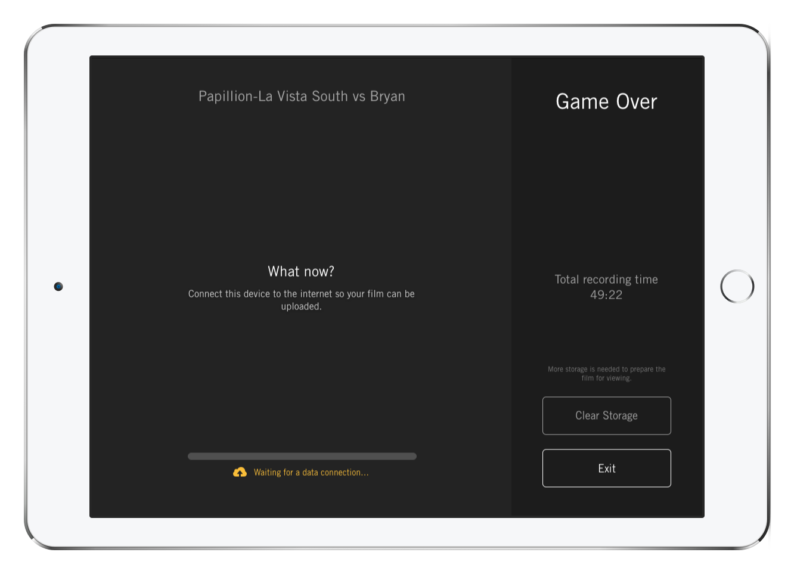
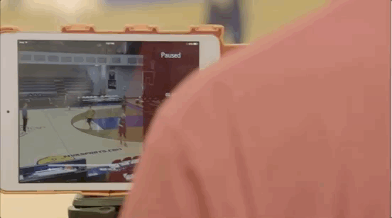

In 2014, I was the lone designer on a team that set out to build Hudl's first suite of tools specifically for basketball. Our market share among high school basketball teams went from 8% to 60% in the next two years.

<iframe src="https://player.vimeo.com/video/139974769" width="640" height="360" frameborder="0" webkitallowfullscreen mozallowfullscreen allowfullscreen></iframe>

### “I need to be able to hand it to a kid”

In Hudl, one of the most valuable things a coach can do is "tag" their game live. An assistant (usually a high school student) sits in the bleachers with a phone or iPad and tries to follow the action, logging events as they happen so that we can layer that data onto the video later for intelligent playback.

In a fast-paced game like basketball, it’s a challenging task even for someone who knows the game well. I spent countless hours courtside with teams, researching how they kept their stat books, watching as students tried to tag games, and tagging games myself.

That research led me to a couple of decisions that I'm particularly proud of.

First, **I made team color a defining element in the UI**. It’s the most obvious differentiator on the court—referees even use it to announce possession or call out fouls—”Number four, green!”. Using color so prominently lowered the bar for taggers. You could walk in off the street and start following along without knowing anything else about the teams.

Second, **I used space to indicate possession**. The team that possesses the ball shifts to occupy 2/3 of the tagging UI. It communicates important information without any extraneous elements, and in action, the animation from one team to the other is a helpful cue that mirrors the transition that the tagger is seeing on the court.

Those may seem like small things to call out, but they’re important because they added up to something that was actually pretty impactful. Along with the large, consistently sized and positioned buttons, these two changes **made it possible to tag without looking directly at the screen**. You can watch the game and hold the device in your peripheral vision, and the shifting colors give you just enough information to know where you are and tag almost by muscle memory.

### How I learned to ask my favorite question

While we were developing the tagging feature we visited and interviewed dozens of coaches, and without fail they would point to uploading as the most tedious part of their process. Most of them were capturing high-definition video on cameras, transferring those files via SD card, and then uploading them to Hudl. It was a huge pain.

Something else we noticed? A lot of the gyms we were visiting had WiFi.

So we thought: Ok, uploading video is annoying and it takes a ton of time. **What if they didn't have to do it at all?**

We set about developing a recording feature that would upload live in the background if the device was connected to WiFi.

It was exciting work. I recorded game after game myself, many of them in this muggy gym in Newark, NJ.

<blockquote class="twitter-tweet" data-lang="en">
Double overtime today. Perfect metaphor for how hard we&#39;re working to to make the new <a href="https://twitter.com/Hudl">@hudl</a> basketball great. <a href="http://t.co/3GpZPvC9pf">pic.twitter.com/3GpZPvC9pf</a>
&mdash; Craig Zheng (@_cz) <a href="https://twitter.com/_cz/status/493923781640216576">July 29, 2014</a></blockquote>

At least there was a [Pollo Campero](http://www.campero.com/) nearby :-)

Keeping up with the constant back-and-forth in a basketball game isn't easy, so I designed a UI that gives the filmer helpful context when they pause or stop, but then "melts away" when they're recording.

The result is still one of Hudl's most popular features. It just saves people so much time and headache. Instead of complicated cameras, instead of trudging back to the office after a game to transfer files, they just hand someone an iPad, and in most cases their video's online before they even leave the court.
