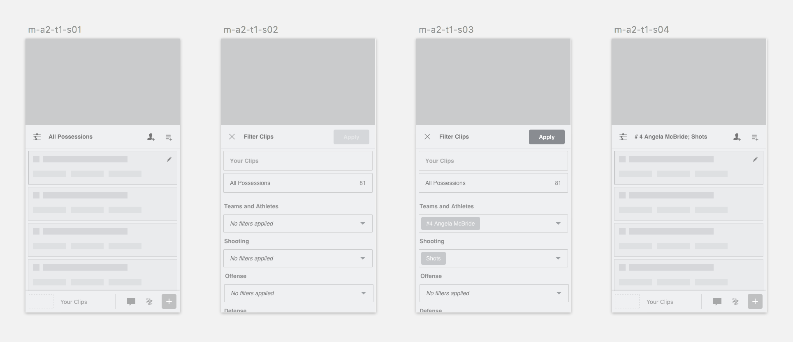
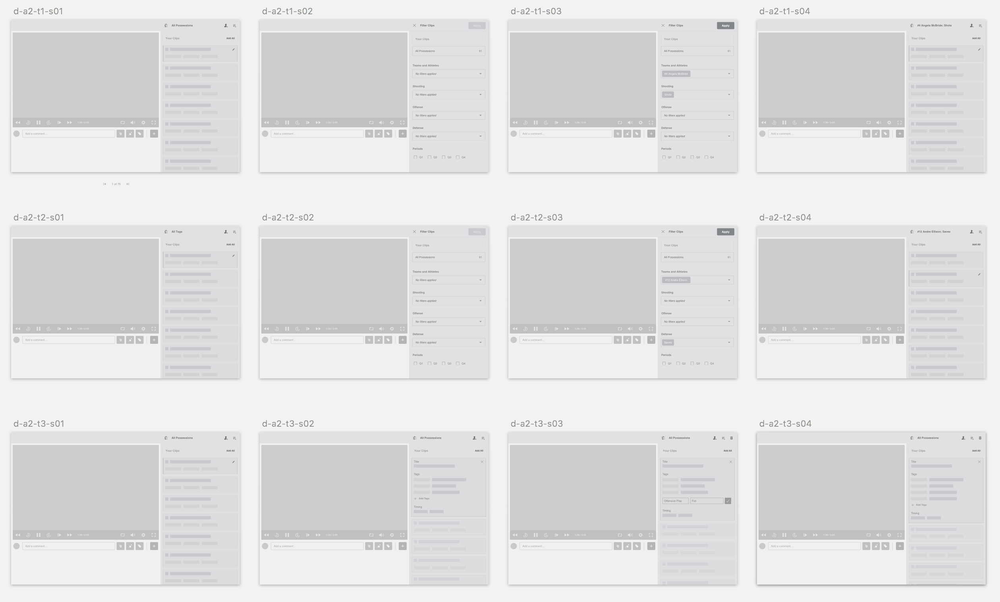
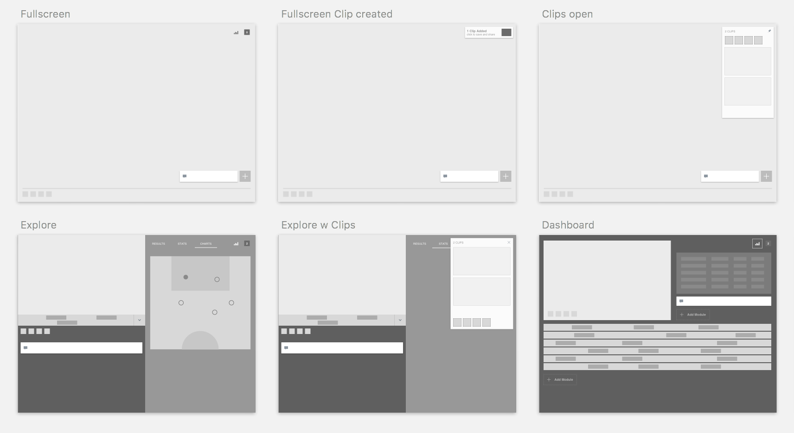

Handle data, filtering, etc.
Handle commenting and drawing

Be advanced enough for professional soccer teams with fulltime video analysts

Be simple enough for high school coach who's also a teacher.

Because we’re trying to accommodate so many kinds of users and tasks I’ve been working to develop a system of progressive disclosure that makes the interface palatable to beginners and intermediates, but makes it easy for them to “slide” into more advanced behavior.

Lots of exploration

Design still evolving.

I worked on the visual design alongside the very talented [Nat Hayward](http://nathayward.com/).

