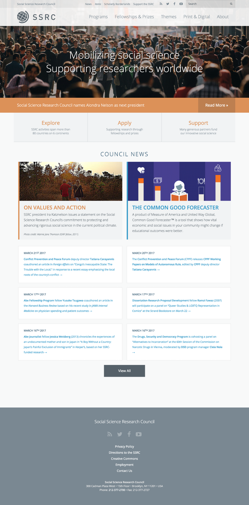
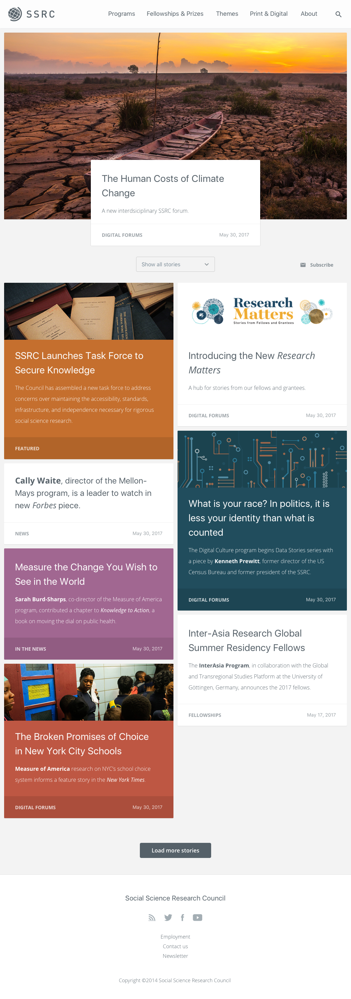

The SSRC is a 93-year-old research organization that has struggled to adjust much of its content for the digital age. Though its website has been through several redesigns in the past decade, the Council still struggles to tell a concise and compelling story about the work it’s doing.

These challenges were apparent right on its homepage, where what was meant to be a varied stream of content and news snippets became a monotonous wall of tiny text.

### Before

In early 2017 I was asked to spend a few hours helping the Council rethink its approach to these content streams. Their intent was to develop a system that would both improve the homepage and underpin a new section of the site that would aggregate content along topical lines.

It was obvious that the content itself needed to be more readable, and that content creators should be able to use imagery and color more easily and systematically.

I also wanted to demonstrate to the Council that _doing less_ on their home page could actually allow them to _say more_. So I simplified the navigation and stripped away almost everything _but_ the content stream from the homepage.

### After

Here, even the so-called hero section is just another item in the stream—a simplification which will give the Council's editors more flexibility and control over the homepage without sacrificing important constraints.

The result is a design that spotlights the Council's day-to-day work, allowing it to form a dynamic narrative that's more compelling than a slogan or mission statement could ever be.
